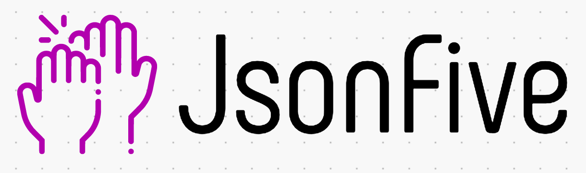

# Awesome profile cards

Proyecto módulo 2 de Adalab. Creación de tarjetas de perfil automáticas.

## Guía de inicio rápido
Para trabajar con este repositorio, te recomendamos clonar en la misma carpeta el repositorio de Adalab Starter Kit. Para el desarrollo del proyecto hemos utilizado:

- HTML
- CSS
- SCSS
- JAVASCRIPT


## ¿Cómo funciona la web?
> ### Con esta web puedes generar tu propia tarjeta personal 👩🏻, con la que podrán comunicarse contigo vía teléfono 📲 o email 📩 . Además, contiene enlaces directos a tus perfiles en linkedIn y en GitHub para que puedan añadirte fácilmente otros usuarios 👥.

## ¿Te contamos los pasos?

1️⃣ DISEÑA: Elige los colores que más te gusten de la paleta.🖍

2️⃣ RELLENA: Rellena todos los campos con tus datos personales. El teléfono no es obligatorio. 📋

3️⃣ Prepara tu mejor foto para subirla. 📸

4️⃣ COMPARTE: Se generará automáticamente una URL con tu tarjeta, y un link para que puedas compartir tu tarjeta personal en Twitter 🐦

5️⃣ Así de fácil!


### Versión lista para subir a producción

En la carpeta **docs/** se generan los CSS y JS minimizados y sin sourcemaps listos para subir al repo y activar GitHub Pages en `master/docs`.


## Estructura del proyecto

La estructura de carpetas 📂 tiene esta estructura:
```
/
`- _src
   |- assets
   |  |- icons
   |  |- images
   |  |- js
   |  `- scss
   |     `- core
		 `_components
   |
   `- templates
      `- partials
/
`- .git
    docs
    node_modules
    public

```

✅ Ayúdanos a mejorar: Siempre dispuestas a escuchar tus sugerencias para mejorar la funcionalidad de esta web y ofrecerte un mejor servicio

🙌🏾 Proyecto hecho con cariño por alumnas de la promoción Grace de Adalab. Muchas gracias por haber llegado hasta aquí.
